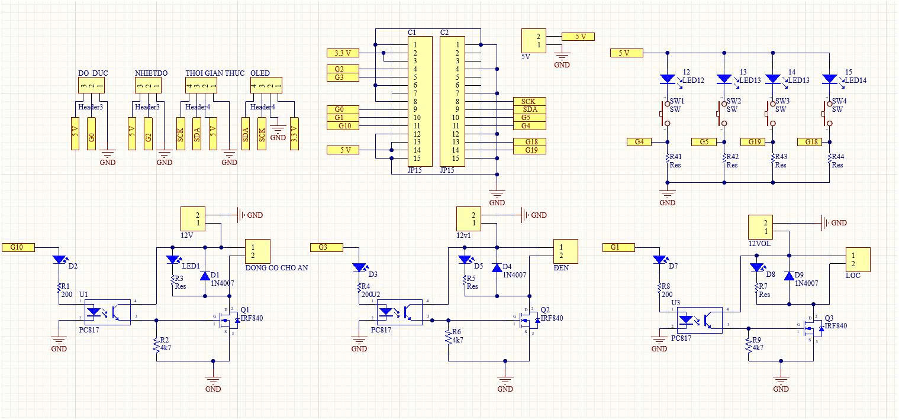
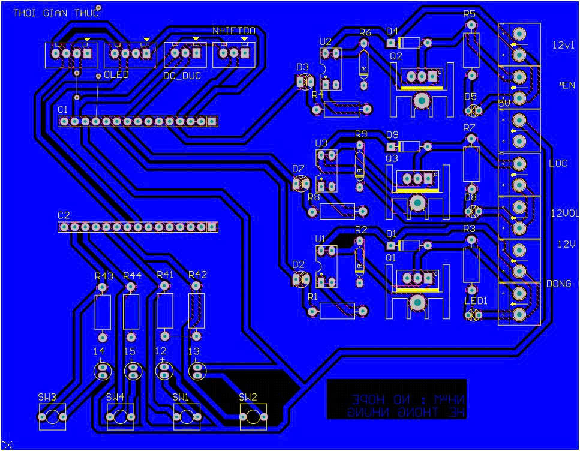
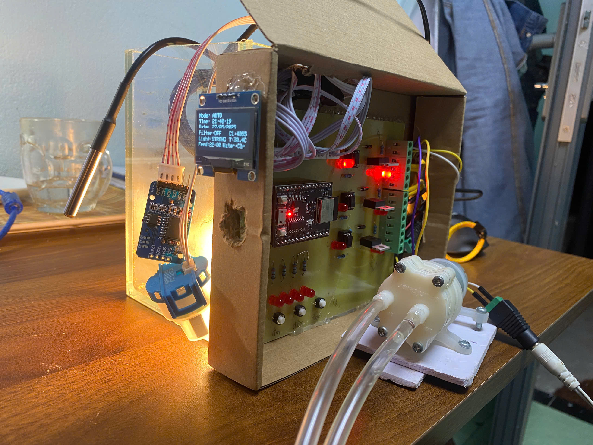
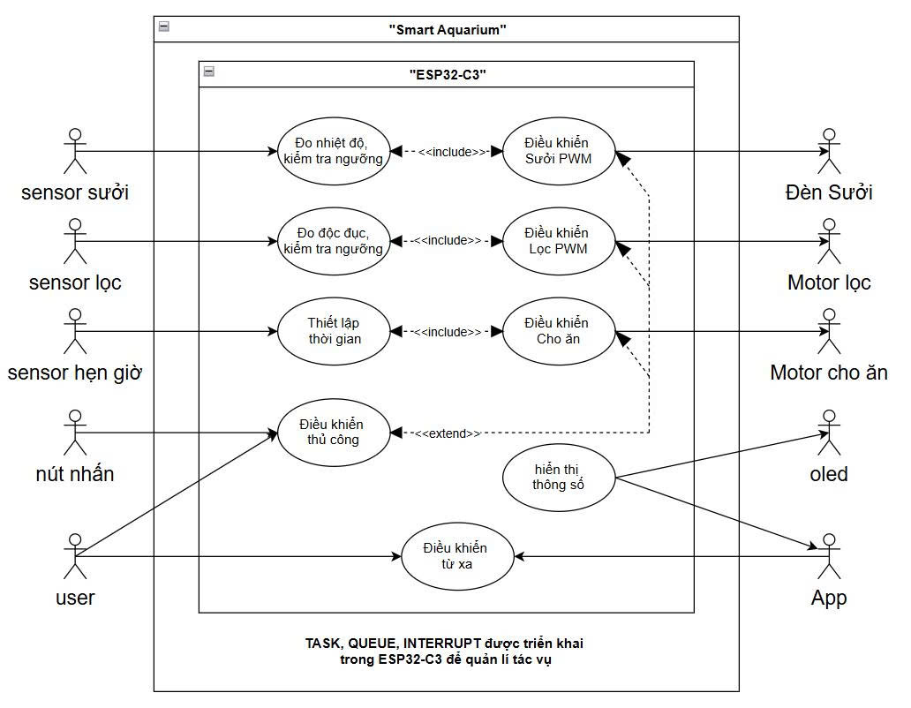

# FreeRTOS

## Introduction
FreeRTOS is an open source, lightweight real-time operating system designed to manage tasks on microcontrollers and embedded systems. The project takes advantage of FreeRTOS features such as multitasking, queuing, and interrupts to manage tasks such as:
- Sensor reading: The SensorTask task continuously collects water temperature and clarity data from the DS18B20 sensor and clarity sensor, sending the data via queue for processing.
- Device Control: The ControlTask ​​handles automatic or manual control logic for the filter motor, heater, and feeder motor, based on sensor data and pushbutton commands.
- Display and Monitoring: The DisplayTask updates the OLED interface with time, device status, and sensor data, while the SerialPrintTask prints information via Serial for monitoring.
## How the System Works
### System Overview:
The system supports two modes: AUTO & MANUAL

AUTO (automatically adjusts filtration and heating based on sensor thresholds and automatically feeds fish at set times)

PWM: Turbidity Sensor
-  (3000 < sensor) PWM = 0: filter motor OFF
-  (2000 < sensor < 3000) PWM = 100: medium filter motor
-  (sensor < 2000) PWM = 255 high filter motor

PWM Water Temperature Sensor DS18B20
-  (32 < sensor) PWM = 0: heater motor OFF
-  (30 < sensor < 32) PWM = 100: medium heater motor
-  (sensor < 30) PWM = 0: high heater motor

PWM Timer Sensor DS3231
-  Setup 11h: PWM = 25: feeding motor rotates in 5s
  
MANUAL (user controls directly via push button)

PWM: Update status every time the button is pressed once: OFF => medium level => high level => OFF

## Quick View of the Project

**Design Circuit Schematic on Altium software**

**Design 2D Circuit Schematic on Altium software**

**System-Aquarium**

**System-Aquarium**

